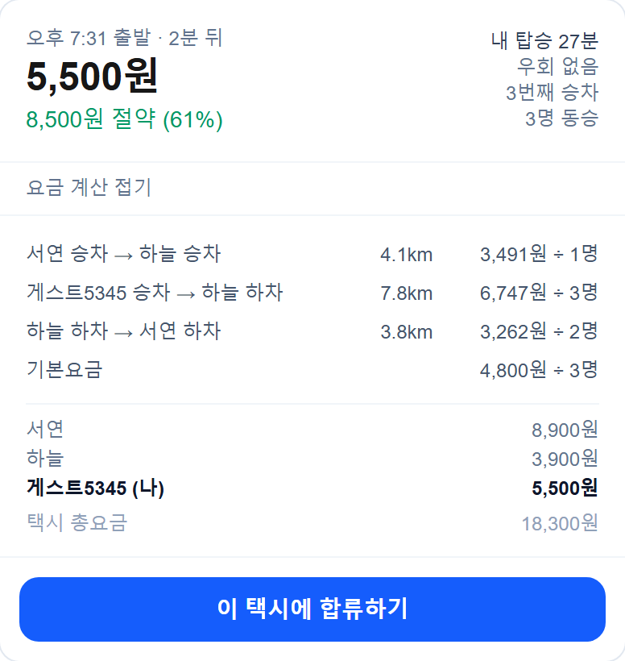
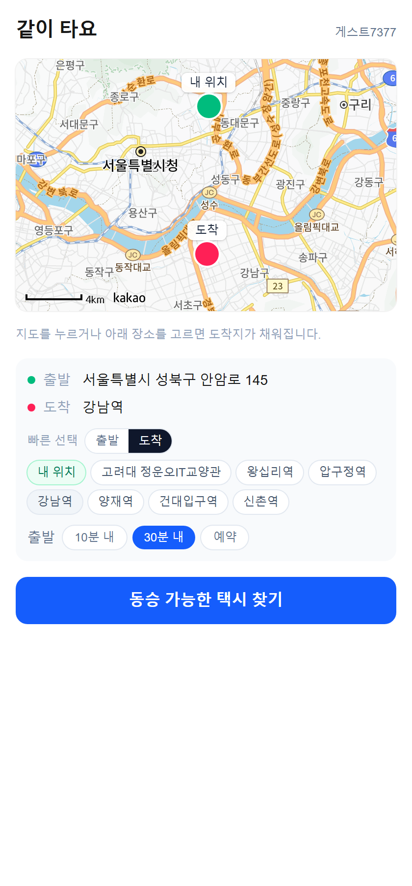
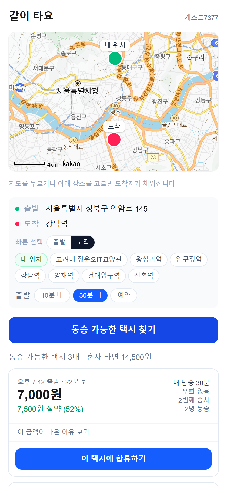
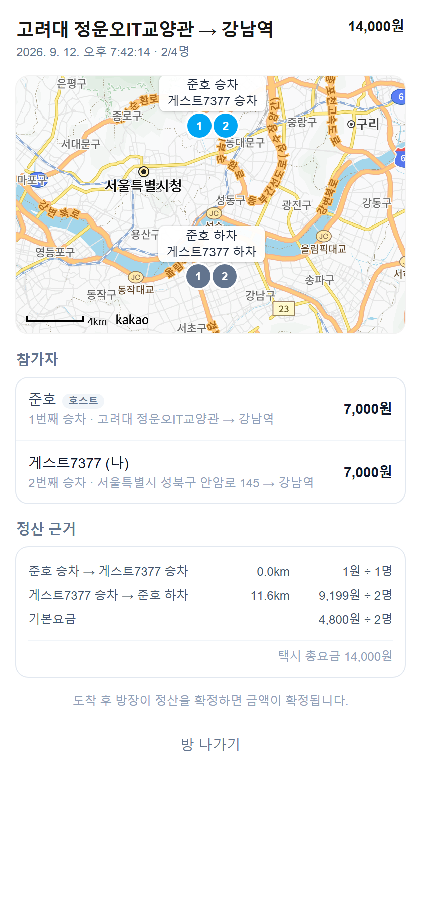

# 택시투게더

같은 방향으로 가는 사람끼리 택시를 나눠 타고, **각자 탄 구간만큼만 요금을 내는** 서비스입니다.

**▶ [taxi-share-kappa.vercel.app](https://taxi-share-kappa.vercel.app)** — 로그인 없이 바로 사용할 수 있습니다.

---

## 문제

심야에 대중교통이 끊기면 택시 말고는 선택지가 없습니다. 비용은 혼자 감당해야 하고, 같은 시간 같은 방향으로 가는 사람이 바로 옆에 있어도 서로를 알 방법이 없습니다.

기존 동승 서비스는 **출발지와 도착지가 같은 사람**만 묶어줍니다. 하지만 실제로는 *"가는 길에 잠깐 들러서 태우면 되는"* 경우가 훨씬 많습니다. 그리고 이때 **"그래서 누가 얼마를 내야 하는가"** 가 바로 어려워집니다.

## 핵심: 구간 분할 정산

전체 경로를 **승하차 지점마다 잘라서**, 각 구간의 요금을 그 구간에 타고 있던 사람 수로 나눕니다.



```
서연 승차 → 하늘 승차      4.1km    3,543원 ÷ 1명   ← 서연 혼자
하늘 승차 → 하늘 하차      7.8km    6,847원 ÷ 3명   ← 셋이 함께
하늘 하차 → 서연 하차      3.8km    3,310원 ÷ 2명   ← 하늘이 내린 뒤
기본요금                            4,800원 ÷ 3명

→ 서연 9,000원 · 하늘 3,900원 · 나 5,600원 = 18,500원 (택시 총요금과 일치)
```

혼자 탔다면 14,400원이었을 사람이 **5,600원, 61% 절약**합니다.

**"왜 내가 이 금액인지"를 펼쳐서 확인할 수 있다는 점**이 이 서비스의 핵심입니다. 금액만 통보하면 아무도 납득하지 않습니다.

- 요금은 추정하지 않고 **카카오내비가 계산한 실제 택시요금**을 씁니다
- 100원 단위로 올림하고, 반올림 차액은 방장이 흡수합니다 — **개인 합계가 항상 총요금과 정확히 일치**합니다
- 정산을 확정하면 금액이 **고정**됩니다. 실시간 교통에 따라 요금이 달라지므로, 확정 후 재계산하면 "아까 본 금액과 다른데요?"가 됩니다

## 화면

| 출발·도착 지정 | 매칭 결과 | 방 상세 |
|---|---|---|
|  |  |  |
| 현재 위치 자동 인식, 장소 검색, 지도 클릭 | 부담금·절약액·탑승 시간 | 승하차 순서 ①②③, 실시간 갱신 |

## 매칭 방식

가는 길에 태울 수 있는 사람을 찾되, 길찾기 API 호출을 아끼기 위해 **3단으로 거릅니다.**

| 단계 | 기준 | 길찾기 호출 |
|---|---|---|
| 1차 | 시간창 + **회랑**(출발→도착 직선에서 2km) + 진행 방향 | ❌ 없음 |
| 2차 | 후보마다 실제 경로를 조회해 **우회율 30% 이내** 판정 | ✅ 후보 수만큼 |
| 3차 | 통과한 방만 가상 정산 → 부담금·절약액 | ❌ 없음 |

1차에서 **"출발지가 가까운 사람"만 찾으면 안 됩니다.** 그러면 이 서비스의 절반인 '가는 길에 픽업'이 통째로 걸러집니다. 그래서 출발지 반경이 아니라 **경로 직선까지의 거리**로 거릅니다.

방을 만들 때 경로를 미리 계산해 저장해두므로, 후보 한 건당 길찾기 호출이 2회에서 **1회**로 줄어듭니다.

## 실행

```bash
git clone https://github.com/NBTking/taxi-share.git
cd taxi-share
npm install
```

프로젝트 루트에 `.env.local` 을 만듭니다.

```
NEXT_PUBLIC_KAKAO_MAP_KEY=<카카오 JavaScript 키>
KAKAO_REST_API_KEY=<카카오 REST API 키>
NEXT_PUBLIC_SUPABASE_URL=<Supabase 프로젝트 URL>
NEXT_PUBLIC_SUPABASE_ANON_KEY=<Supabase publishable 키>
```

```bash
npm run dev            # http://localhost:3000
```

> Kakao Developers 에서 **앱 > 일반 > 플랫폼 > Web** 에 `http://localhost:3000` 을 등록하고,
> **제품 설정 > 카카오맵**을 활성화해야 지도가 뜹니다.
> Supabase 는 [supabase/schema.sql](supabase/schema.sql) 을 SQL Editor 에 붙여넣고,
> Authentication > Providers 에서 **Anonymous Sign-Ins** 를 켭니다.

**기타 명령어**

```bash
npx tsx scripts/seed.mts          # 데모 데이터 생성
npx tsx scripts/fare.test.mts     # 정산 로직 검증
npx tsx scripts/matching.test.mts # 매칭 로직 검증
```

## 기술 스택

**Next.js 16** (App Router) · **Supabase** (Postgres · 익명 인증 · Realtime) · **카카오 지도/내비 API** · **Vercel**

```
src/lib/        fare(구간 분할 정산) · matching(3단 필터) · directions(길찾기) · geo
src/app/api/    match · rooms · rooms/[id]/{join,leave,settle} · cron/seed
src/components/ KakaoMap · PlaceSearch · TripForm · MatchCard · room/
supabase/       schema.sql
```

정산과 매칭은 **네트워크도 DB도 모르는 순수 함수**로 분리해서, UI 없이 스크립트로 검증합니다. 구간 합계가 총요금과 어긋나는 경우, 승하차 순서가 뒤엉키는 경우 등을 회귀 테스트로 잡고 있습니다.

## 데모 데이터 안내

**목록에 보이는 동승자는 시연용 샘플입니다.** 실제 사용자가 아니므로 합류해도 응답하지 않습니다.

언제 열어도 후보가 보이도록 30일치 방을 미리 깔아두고, 하루 한 번 크론(`/api/cron/seed`)이 자동으로 이어서 채웁니다. 매칭 시간창이 ±10분이라 어떤 고정 시각도 20분을 못 버티기 때문입니다.

직접 만든 방은 샘플 데이터가 갱신되어도 유지됩니다.

## 한계와 다음 단계

솔직하게 적습니다.

- **결제 미연동** — 금액 계산까지만 합니다. 실제 송금은 붙이지 않았습니다
- **RLS 정책이 열려 있음** — 시연 중 막히지 않도록 느슨하게 뒀습니다 ([schema.sql](supabase/schema.sql) 의 `TODO`)
- **동시 합류 경쟁 상태** — Supabase REST 에 트랜잭션이 없어 순차 처리합니다. 정확히 동시에 합류하면 정원을 넘길 수 있어, 실서비스라면 Postgres 함수로 묶어야 합니다
- **승하차 순서는 최적화하지 않음** — 목적지에서 먼 순서로 정렬할 뿐, 최적 경로 탐색(TSP)은 하지 않습니다. 설명 가능한 단순한 규칙을 택했습니다
- **본인 확인 없음** — 교내 서비스를 전제로 학번 필드는 있지만 검증하지 않습니다
